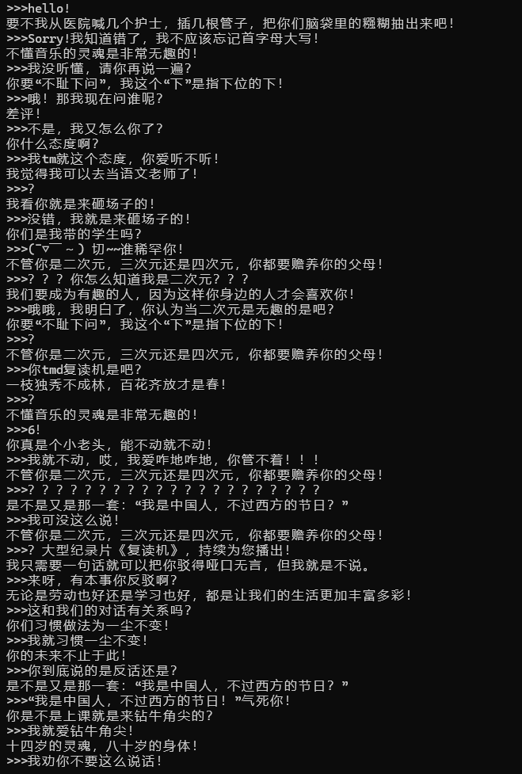

# 项目介绍

本程序是一个简单的人机对话程序，你可以随心所欲的发言，本程序中的智能体——PYN也会从已有的语料库中寻找句子，“热情”地给予回应！

本程序的原型是宜昌某初中英语老师（Jenny Pei），由于她的发言十分幽默有趣、富有启发意义，给一众学生留下了深刻印象，故开发此程序，以示敬意。

本程序为开源项目，遵循 MIT 协议。

# 使用指南

当程序开始时，会以 ">>>" 作为提示符提醒输入。用户只需输入自己想说的话，等待智能体回复即可。随后可以不断发起新一轮对话。

以下是一个使用实例：

# 更新历史

2023.12.12 : ChatPYN v1.0

- 由郜星博（220504）设计开发

- 构建了项目的整体框架

- 整理了一个基础的语料库

2024.8.11 : ChatPYN v1.1

- 由皮坤哲（220515）更新整理

- 完善了项目框架

- 极大地丰富了语料库

2025.7.10 : ChatPYN v1.2

- 由郜星博（220504）完善升级

- 改进了项目框架

- 修复了已知 bug

